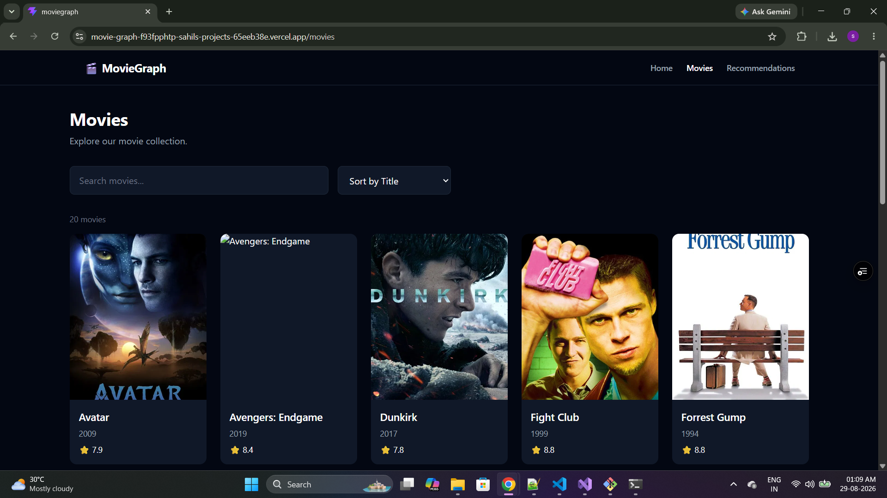
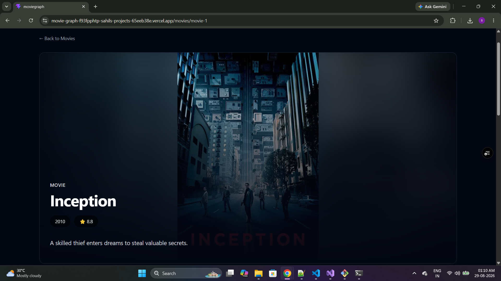
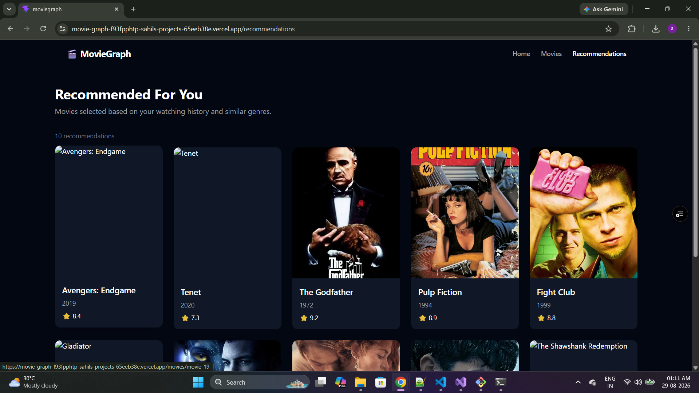
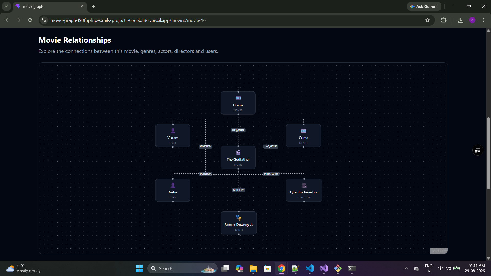

MovieGraph

A graph-powered movie discovery and recommendation application built
with ASP.NET Core Web API, CognoDB, React, TypeScript, and Tailwind CSS.

Overview

MovieGraph models users, movies, genres, actors/directors, and their
relationships as a graph. The application uses graph traversals to
explore movies and generate recommendations from a user's watch history
and genre connections.

Why a Graph Database?

The recommendation problem is relationship-driven rather than just
record-driven.

A typical traversal is:

User
  └── WATCHED → Movie
                  └── HAS_GENRE → Genre
                                   ↑
                                   └── HAS_GENRE ← Movie

This lets the application naturally answer questions such as:

Which movies are connected to movies a user has already watched?

Which genres are shared by the user's watched movies?

Which unseen movies have the strongest genre overlap?

How are movies, genres, actors, and directors connected?

A relational database can model the same information, but these
recommendations require multiple joins across relationship tables. A
graph database represents these connections directly, making multi-hop
traversal more natural and expressive.

Technology Stack:

Backend:

C#

ASP.NET Core Web API

CognoDB

Official Neo4j .NET Driver

openCypher

Clean Architecture

Repository Pattern

Dependency Injection

Serilog

Health Checks

Swagger / OpenAPI

Frontend:

React

TypeScript

Vite

Tailwind CSS

React Router

Axios

TanStack Query

Architecture:

React UI
   │
   │ HTTP
   ▼
ASP.NET Core API
   │
   ├── Application Services
   │
   ├── Global Exception Middleware
   │
   └── Serilog
          │
          ▼
   Infrastructure
   │
   ├── Repositories
   ├── Cypher Queries
   ├── Seed Data
   └── Health Checks
          │
          ▼
       CognoDB

Project Structure:

MovieGraph/
├── MovieGraph.Api/
│   ├── Controllers/
│   ├── Middleware/
│   ├── Models/
│   └── Program.cs
│
├── MovieGraph.Application/
│   ├── DTOs/
│   ├── Exceptions/
│   ├── Interfaces/
│   └── Services/
│
├── MovieGraph.Domain/
│   └── Entities/
│
├── MovieGraph.Infrastructure/
│   ├── HealthChecks/
│   ├── Queries/
│   ├── Repositories/
│   └── Seed/
│
└── frontend/

Graph Data Model

Main nodes:

User

Movie

Genre

Actor

Director

Main relationships:

User -[:WATCHED]-> Movie

Movie -[:HAS_GENRE]-> Genre

Movie -[:ACTED_BY]-> Actor

Movie -[:DIRECTED_BY]-> Director

Simplified model:

(User)
   │
   │ WATCHED
   ▼
(Movie) ── HAS_GENRE ──> (Genre)
   │
   ├── ACTED_BY ───────> (Actor)
   │
   └── DIRECTED_BY ────> (Director)

Movie properties include:

id
title
releaseYear
rating
description
posterUrl

Recommendation Engine

The recommendation query performs a multi-hop graph traversal:

User
 → WATCHED
 → Movie
 → HAS_GENRE
 → Genre
 → HAS_GENRE
 → Recommended Movie

The query excludes movies the user has already watched and scores
candidates according to distinct shared genres. Results are ordered by
recommendation score and then by movie rating.

Example:

MATCH (u:User {id: $userId})
      -[:WATCHED]->
      (watched:Movie)

WITH u, collect(DISTINCT watched.id) AS watchedMovieIds

MATCH (u)-[:WATCHED]->(watchedMovie:Movie)
      -[:HAS_GENRE]->(genre:Genre)
      <-[:HAS_GENRE]-(recommended:Movie)

WHERE NOT recommended.id IN watchedMovieIds

WITH recommended, count(DISTINCT genre) AS score

RETURN
    recommended.id AS id,
    recommended.title AS title,
    recommended.releaseYear AS releaseYear,
    recommended.rating AS rating,
    recommended.description AS description,
    recommended.posterUrl AS posterUrl,
    score

ORDER BY score DESC, recommended.rating DESC
LIMIT $limit

All application Cypher queries are parameterized and executed through
the official Neo4j .NET driver.

Seed Data:

The repository includes a seed script containing realistic movie, user,
genre, actor/director, and relationship data.

The movie dataset includes:

Inception

Interstellar

The Dark Knight

The Prestige

Oppenheimer

Tenet

Dunkirk

Memento

Avatar

Titanic

The Matrix

The Lord of the Rings

The Shawshank Redemption

Fight Club

Forrest Gump

The Godfather

Pulp Fiction

Gladiator

Avengers: Endgame

Spider-Man: No Way Home

Movie poster images are not stored inside CognoDB. Only the external
posterUrl string is stored on each movie node.

Configuration:

CognoDB credentials must be provided through environment variables or
local configuration and must never be committed to Git.

Running the Backend

Prerequisites

.NET SDK

A CognoDB instance

CognoDB connection credentials

From the backend project:

dotnet restore
dotnet build
dotnet run

Swagger/OpenAPI is available from the configured Swagger endpoint.

Health check:

GET /health

The health check performs a lightweight database query to verify CognoDB
connectivity.

Running the Frontend

From the frontend directory:

npm install
npm run dev

Configure the frontend API base URL according to the environment
configuration used by the project.

API Capabilities

The API supports:

Listing movies.

Getting a movie by ID.

Finding similar movies.

Getting personalized movie recommendations.

Working with movie relationships.

Seeding the graph database.

Common HTTP responses include:

200 OK
400 Bad Request
404 Not Found
500 Internal Server Error

Error Handling

A global exception middleware provides consistent API error responses.

Expected application exceptions are converted to appropriate HTTP status
codes. Unexpected exceptions return a generic message rather than
exposing internal implementation details.

Error responses contain a trace ID that can be correlated with
server-side logs.

Example:

{
  "statusCode": 500,
  "message": "An unexpected error occurred.",
  "traceId": "..."
}

Logging

Serilog is used for application logging and troubleshooting.

The trace ID returned to the client helps correlate an API error with
server logs.

Sensitive database credentials are not logged.

Main Graph Queries

User watched movies

MATCH (u:User)-[:WATCHED]->(m:Movie)
RETURN u.name, m.title

Movie genres

MATCH (m:Movie)-[:HAS_GENRE]->(g:Genre)
RETURN m.title, g.name

Multi-hop recommendation

User → WATCHED → Movie → HAS_GENRE → Genre ← HAS_GENRE ← Movie

This multi-hop traversal demonstrates the part of the use case where a
graph database provides a natural modeling and querying approach.

UI Screenshots:

   

Hosted Demo
Demo URL: https://movie-graph-f93fpphtp-sahils-projects-65eeb38e.vercel.app

The hosted application demonstrates the end-to-end flow from the React
frontend to the ASP.NET Core API and CognoDB.
